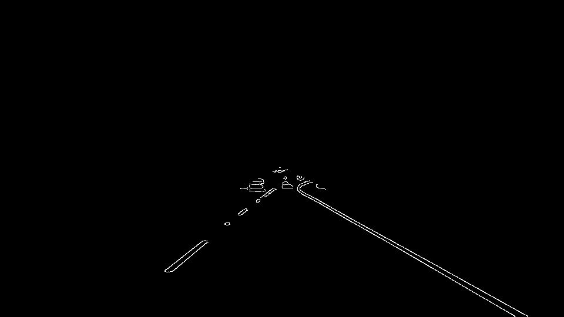
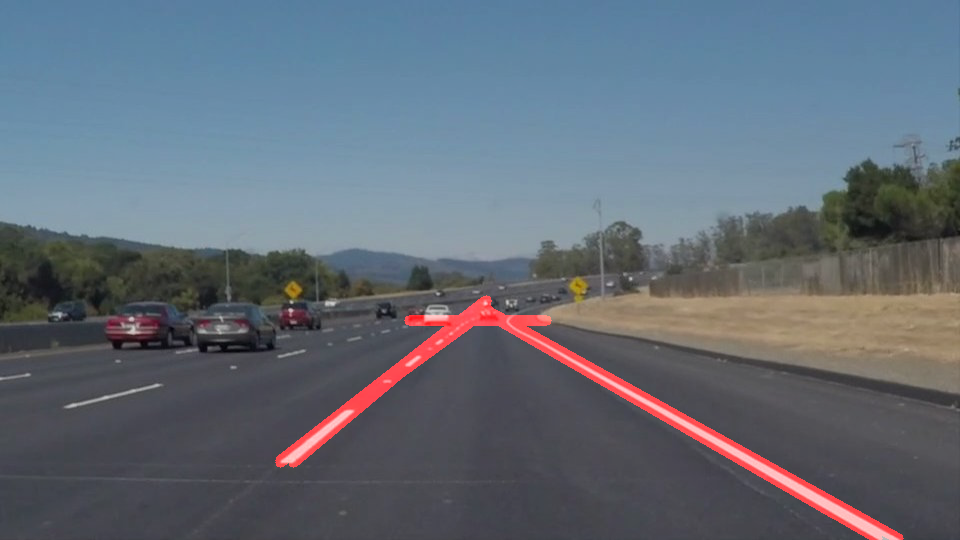

# **Writeup: Finding Lane Lines on the Road** 

## Goal

The goals / steps of this project are the following:

* Make a pipeline that finds lane lines on the road
* Reflect on your work in a written report
 

## Reflection

### 1. The Pipeline

The goal is to find the lane lines in the following original images, something like this.

**Step 1. Turn the RGB image into grayscale**

Using OpenCV, turn RGB image into grayscale.

**Step 2. Using Canny to find the edges**

Before applying Canny function to the image, do the Gaussian blur first (I used kenerl size 15)

**Step 3. Applying region mask**

Considering the camera is fixed on the top of the car, we can assume the lane lines are in some certain position of the image. We can reduce much noise when applying region mask in the image.

**Step 4. Hough Transform**

Using Hough Transform to find the (segmented) lines.

**Step 5. Using Numpy.Polyfit to find the lane lines**

Assuming that the lane lines are straight lines, which is y = m*x + b, I use Polyfit in Numpy to find the line to fit the the points.

For each segment line in Hough lines, calcute m = (y2-y1)/(x2-x1), depends on m's value (<0 or >0), group the points (x1,y1) and (x2,y2) into left line points (or right line points). There are min and max threshold values for m to eliminate noise. Then use Polyfit function in Numpy to find the 2 lines.

### 2. Potential shortcomings with current pipeline

* One potential shortcoming would be many hyperparameter tuning. There are so many hyperparameters are set by hard coding, especially Canny thresholds and Hough lines parameters. My gut feeling is those parameters could vary a lot in different roads or under different weather conditions.

* Another shortcoming could be the lane lines assumption - "they are linear y = m*x + b" - are not always true, especially when turing. We might need a 2 or 3 degree polynomial to fit the line.

### 3. Possible improvements

* A possible improvement would be to use Neural Network to tune the parameters.

* Another potential improvement could be to use non-linear function to fit the lane lines.
